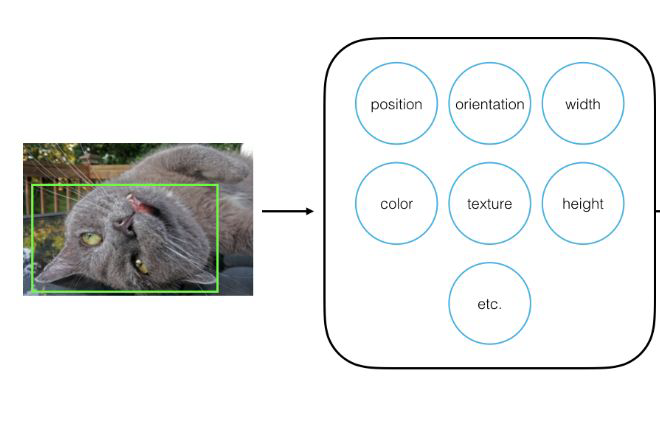
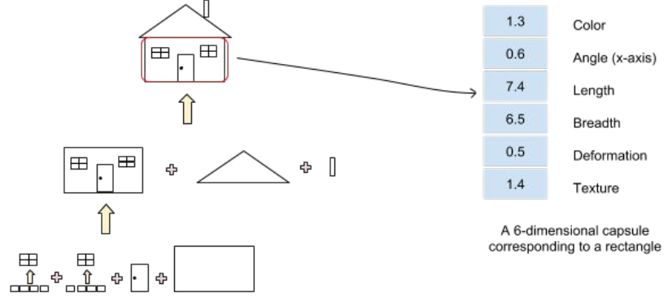

# Capsule Networks on MNIST Dataset

## Introduction

Thi repo focuses on implementing Capsule Networks for the MNIST dataset. Capsule Networks, introduced by Geoffrey Hinton, are a new type of neural network architecture designed to better model hierarchical relationships and spatial hierarchies in image data. This repository contains code, documentation, and resources to help you understand and implement Capsule Networks.

## Table of Contents

1. [Theory](#theory)
2. [Model Architecture](#model-architecture)
    - [Encoder](#encoder)
    - [Decoder](#decoder)
3. [Training and Testing](#training-and-testing)
4. [Reconstruction](#reconstruction)
5. [Usage Guide](#usage-guide)
6. [Task](#task)
7. [References](#references)

## Theory

Capsules are groups of neurons that output multi-dimensional vectors representing various properties of image parts, such as position, size, orientation, and texture. They are designed to preserve the spatial hierarchies between features, which is essential for recognizing objects in different orientations and overlapping conditions.




### Advantages of Capsule Networks

-   Improved object identification in various orientations.
-   Better recognition of multiple, overlapping objects.
-   Enhanced learning from smaller training datasets.

## Model Architecture

### Encoder

The encoder is responsible for transforming the input MNIST image (28x28 pixels) into a 16-dimensional vector.

1. **Convolutional Layer**: Extracts features like edges from the input image.

    ```python
    class ConvLayer(nn.Module):
        def __init__(self, in_channels=1, out_channels=256):
            super(ConvLayer, self).__init__()
            self.conv = nn.Conv2d(in_channels, out_channels, kernel_size=9, stride=1, padding=0)
        def forward(self, x):
            features = F.relu(self.conv(x))
            return features
    ```

2. **Primary Capsules**: Transform feature maps into capsules that represent the presence and properties of features.

    ```python
    class PrimaryCaps(nn.Module):
        def __init__(self, num_capsules=8, in_channels=256, out_channels=32):
            super(PrimaryCaps, self).__init__()
            self.capsules = nn.ModuleList([nn.Conv2d(in_channels, out_channels, kernel_size=9, stride=2, padding=0) for _ in range(num_capsules)])
        def forward(self, x):
            batch_size = x.size(0)
            u = [capsule(x).view(batch_size, 32 * 6 * 6, 1) for capsule in self.capsules]
            u = torch.cat(u, dim=-1)
            u_squash = self.squash(u)
            return u_squash
    ```

3. **Digit Capsules**: Represent the whole entities (digits 0-9) using dynamic routing to find optimal connections between capsules.
    ```python
    class DigitCaps(nn.Module):
        def __init__(self, num_capsules=10, prev_layer_nodes=32*6*6, in_channels=8, out_channels=16):
            super(DigitCaps, self).__init__()
            self.W = nn.Parameter(torch.randn(num_capsules, prev_layer_nodes, in_channels, out_channels))
        def forward(self, u):
            u = u[None, :, :, None, :]
            u_hat = torch.matmul(u, self.W)
            b_ij = torch.zeros(*u_hat.size())
            v_j = dynamic_routing(b_ij, u_hat, self.squash, routing_itrs=3)
            return v_j
    ```

### Decoder

The decoder reconstructs the input image from the output vectors of the DigitCaps layer.

```python
class Decoder(nn.Module):
    def __init__(self, inp_vec_len=16, inp_capsules=10, hidden_dim=512):
        super(Decoder, self).__init__()
        input_dim = inp_vec_len * inp_capsules
        self.linear_layers = nn.Sequential(
            nn.Linear(input_dim, hidden_dim),
            nn.ReLU(),
            nn.Linear(hidden_dim, hidden_dim),
            nn.ReLU(),
            nn.Linear(hidden_dim, 28 * 28),
            nn.Sigmoid()
        )
    def forward(self, x):
        classes = (x ** 2).sum(dim=-1) ** 0.5
        classes = F.softmax(classes, dim=-1)
        _, max_length_indices = classes.max(dim=1)
        sparse_matrix = torch.eye(10)
        y = sparse_matrix.index_select(dim=0, index=max_length_indices.squeeze(1).data)
        reconstr = self.linear_layers((x * y[:, :, None]).view(x.size(0), -1))
        return reconstr, y
```

## Training and Testing

### Training

The training process involves the following steps:

1. Clear gradients.
2. Forward pass through the network.
3. Calculate loss using a custom loss function that combines margin loss and reconstruction loss.
4. Backward pass to compute gradients.
5. Optimization step to update network parameters.

```python
def train(capsule_net, criterion, optimizer, n_epochs, train_loader, print_every=300):
    for epoch in range(1, n_epochs + 1):
        train_loss = 0.0
        capsule_net.train()
        for batch_i, (imgs, target) in enumerate(train_loader):
            optimizer.zero_grad()
            caps_output, reconstr, y = capsule_net(imgs)
            loss = criterion(caps_output, target, imgs, reconstr)
            loss.backward()
            optimizer.step()
            train_loss += loss.item()
            if batch_i % print_every == 0:
                print(f'Epoch: {epoch}/{n_epochs}, Batch: {batch_i}, Loss: {train_loss/print_every}')
                train_loss = 0
```

### Testing

Testing evaluates the performance of the trained model on unseen data.

```python
def test(capsule_net, test_loader):
    capsule_net.eval()
    test_loss, total_accuracy = 0, 0
    for imgs, target in test_loader:
        caps_output, reconstr, y = capsule_net(imgs)
        loss = criterion(caps_output, target, imgs, reconstr)
        test_loss += loss.item()
        accuracy = (y.argmax(dim=1) == target).float().mean()
        total_accuracy += accuracy.item()
    print(f'Test Loss: {test_loss / len(test_loader)}, Accuracy: {total_accuracy / len(test_loader)}')
```

## Reconstruction

To evaluate the decoder's performance, we compare the original and reconstructed images.

```python
def show_images(original_imgs, reconstructed_imgs):
    num_images = 10
    fig, axes = plt.subplots(nrows=2, ncols=num_images, figsize=(20, 4))
    for i in range(num_images):
        ax = axes[0, i]
        ax.imshow(original_imgs[i].reshape(28, 28), cmap='gray')
        ax.axis('off')
        ax = axes[1, i]
        ax.imshow(reconstructed_imgs[i].reshape(28, 28), cmap='gray')
        ax.axis('off')
    plt.show()
```

## Usage Guide

### Prerequisites

-   Python 3.x
-   PyTorch
-   Matplotlib
-   Numpy

### Installation

1. Clone the repository:
    ```sh
    git clone https://github.com/your-username/capsule-networks.git
    cd capsule-networks
    ```
2. Install the required packages:
    ```sh
    pip install -r requirements.txt
    ```

### Running the Model

1. Download and preprocess the MNIST dataset.
2. Train the Capsule Network:
    ```sh
    python train.py
    ```
3. Test the Capsule Network:
    ```sh
    python test.py
    ```
4. Visualize the reconstructions:
    ```sh
    python visualize.py
    ```

## Task

Implement Capsule Networks on a new dataset such as Fashion-MNIST or CIFAR-10 to explore its adaptability and efficacy in more complex settings.

## References

-   [Dynamic Routing Between Capsules](https://arxiv.org/pdf/1710.09829.pdf)
-   [Beginner's Guide to Capsule Networks](https://www.kaggle.com/code/fizzbuzz/beginner-s-guide-to-capsule-networks)
-   [Essentials of Deep Learning: CapsuleNets](https://www.analyticsvidhya.com/blog/2018/04/essentials-of-deep-learning-getting-to-know-capsulenets/)
-   [Introduction to Capsule Neural Networks | ML - GeeksforGeeks](https://www.geeksforgeeks.org/capsule-neural-networks-ml/)
-   [Capsule Networks Tutorial](https://www.youtube.com/watch?v=pPN8d0E3900)
-   [Introduction to Capsule Networks | Paperspace Blog](https://blog.paperspace.com/capsule-networks/)

By following this guide, you should be able to implement and understand Capsule Networks effectively. For any issues or questions, please open an issue on the repository. Happy coding!
